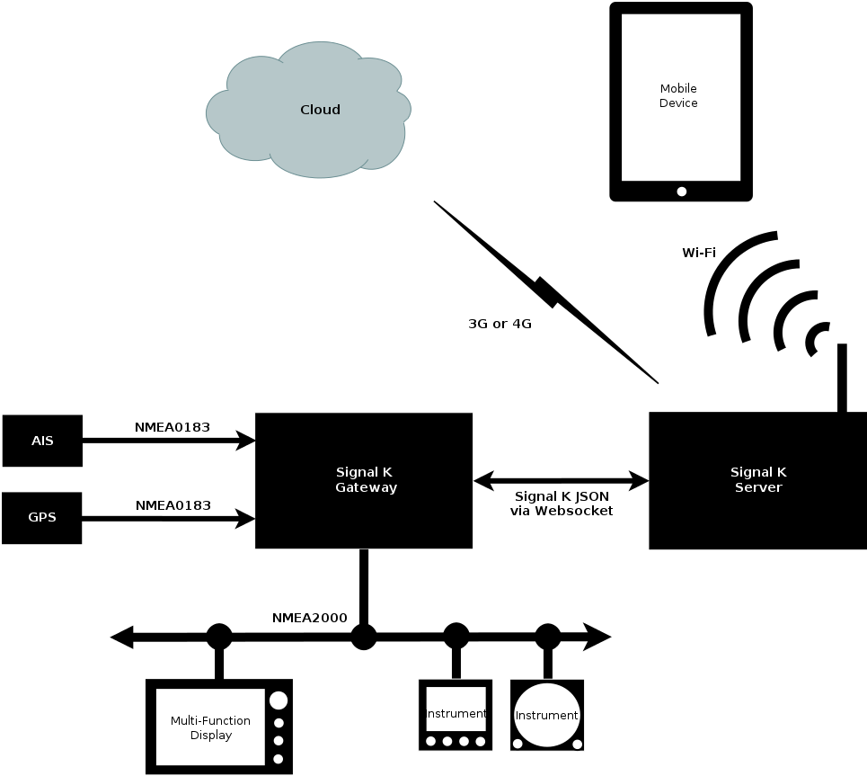
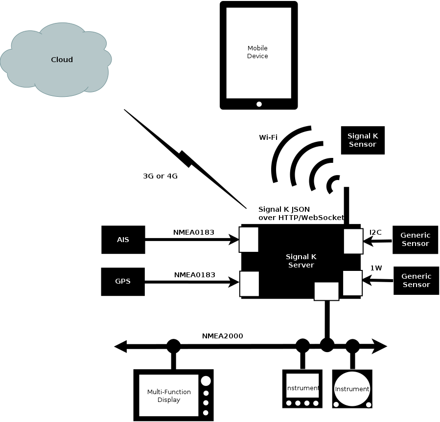

# Introduction

This is the documentation for the [Signal K Specification](https://github.com/signalk/specification) _version_
version, which is available in the following formats;

* [html](http://signalk.org/specification/_version_/) (this document) _version_
* [pdf](http://signalk.org/specification/_version_/signalk.pdf)
* [epub](http://signalk.org/specification/_version_/signalk.epub)
* [mobi](http://signalk.org/specification/_version_/signalk.mobi)

## What is Signal K?

**Signal K** is a modern and open data format for marine use. It is an Internet friendly standard built on common web
technologies, such as JSON and WebSockets. Signal K is Free and Open Source software. This document is licensed under
the Creative Commons [CC-BY-SA](https://creativecommons.org/licenses/by-sa/4.0/) license. All Signal K source code is
licensed under the [Apache License, Version 2.0](https://www.apache.org/licenses/LICENSE-2.0). Signal K is developed in
the open with help from the marine community. Your ideas and feedback are valuable and welcome.

Signal K is designed to work in harmony with a boat’s existing navigation equipment which may use NMEA0183, NMEA2000 or
proprietary data protocols, converting and enhancing this information into a modern “web friendly” format which can be
shared, processed and displayed on the latest web apps, mobile devices and cloud servers. A typical NMEA based
installation consists of an NMEA to Signal K gateway and an optional Signal K server. The gateway translates NMEA data
into Signal K format and the server can host additional functions like logging, cloud integration and data analysis.

One major advantage of Signal K is the ability to represent data from heterogeneous sources. In addition to traditional
NMEA sources, data from generic sensors as well as modern Signal K enabled sensors can be fused into a single data
model and a single protocol for accessing the data. Another typical configuration is a Signal K server with adapters
and converters for the different sources.

## Signal K Data Model (A.K.A. The Schema)

The Signal K Data Model or schema defines a universal model for marine related information and it is specified as a
JSON schema. See the [Signal K Data Model](data_model.md) section for details.

In traditional marine standards there are many tightly defined messages, each with a specific purpose, but there is no
data model to relate them. Furthermore, any device which needs to decode those messages must have a copy of the data
dictionary in order to do so. By defining a data model in JSON we can make the messaging layer simpler and easily
extensible. We define consistent units and meta data for each data point in the model. This means that a specific data
point (e.g. COG) will always be found at a predictable address.

It also means that a display device such as a chartplotter implementing Signal K does not need to know about the data
model beforehand. It can query the central Signal K server on the boat to get all the information it needs to display
any data point. This **metadata** may include information such as the unit of measure, minimum and maximum permissible
values, alarm thresholds and localized display name for every data point in the model.

### Signal K Message Format

Signal K defines methods for combining arbitrary data from the Data Model into valid messages. These messages are in
UTF-8 JSON format.

Rather than define hundreds of specific messages, Signal K has a few common message formats which can contain any
combination of data from the Data Model. This means that there is no need to define new messages for every new data
point or command which needs to be supported, rather the message format remains the same and only the data transmitted
needs to change. It means that any device can read any message and a device can introduce a new data point which can be
understood by existing devices without the need for firmware upgrades.

## Signal K Transport Layer

Signal K does not define the transport or wire protocol. Signal K messages are JSON text and can be sent over almost
any physical transport layer. However, the Signal K standard does provide guidance on how to establish an initial
connection, handle negotiation, subscription, and disconnection for a given transport (e.g. TCP/IP or serial).

Where possible Signal K uses well established standards like HTTPS, REST, and WebSockets. However, these should not be
interpreted as required dependencies of Signal K. It is entirely possible and permissible to implement the protocol
over any transport that your implementation requires.

The goal is to try to establish sensible conventions for each transport in order to make development and
interconnection more predictable.

## Signal K Implementations

The Signal K project has Open Source reference server implementations in
[Node](https://github.com/SignalK/signalk-server-node) and [Java](https://github.com/SignalK/signalk-server-java).
There are also several web apps provided by the project which can be installed directly in the Node and Java servers or
downloaded from [Signal K GitHub](https://github.com/SignalK). There are also commercial
[Signal K applications and solutions](http://signalk.org/applications_solutions.html), including mobile apps available
on the Apple App and Android Play Stores, as well as hardware products like [iKommunicate](http://ikommunicate.com/).
