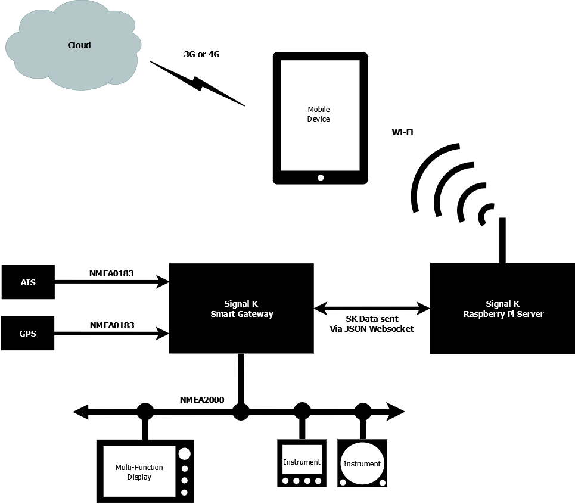

# Introduction

This is the documentation for the [Signal K Specification](https://github.com/signalk/specification) master (latest)
version, which is available in the following formats;

* [html](http://signalk.org/specification/master/) (this document)
* [pdf](http://signalk.org/specification/master/signalk_master.pdf)
* [epub](http://signalk.org/specification/master/signalk_master.epub)
* [mobi](http://signalk.org/specification/master/signalk_master.mobi)

## What is Signal K?

**Signal K** is a modern and open data format for marine use. It is an Internet friendly standard built on standard web
technologies, such as JSON and WebSockets. Signal K is Free and Open Source software. This document is licensed under
the Creative Commons [CC-BY-SA](https://creativecommons.org/licenses/by-sa/4.0/) license. All Signal K source code is
licensed under the [Apache License, Version 2.0](https://www.apache.org/licenses/LICENSE-2.0). Signal K is developed in
the open with help from the marine community. Your ideas and feedback are valuable and welcome.

Signal K is designed to work in harmony with the boat's existing navigation equipment that might use NMEA0183, NMEA2000 or proprietary data protocols, converting and enhancing this information in to a modern "web friendly" format that can be shared, processed and displayed on the latest web apps, mobile devices and cloud servers.

At its core, **Signal K** consists of the Signal K Data Model and the Signal K Message Format, which allows marine data to be produced by Signal K sensors or converted via a Signal K gateway (from existing NMEA systems), which is then processed, logged and added to by a Signal K server, before being consumed by and App or Cloud service. The diagram below shows a typical Signal K system...

  

## Signal K Data Model (A.K.A. The Schema)

The Signal K Data Model or schema defines a universal model for marine related information and it is specified as a JSON
schema. See the [Signal K Data Model](data_model.md) section for details.

In traditional marine standards there are many tightly defined messages, each with a specific purpose, but there is no
data model to relate them. Furthermore, any device which needs to decode those messages must have a copy of the data
dictionary in order to do so. By defining a data model in JSON we can make the messaging layer simpler, and easily
extensible. We define consistent units and meta data for each data point in the model. This means that a specific data
point (e.g. COG) will always be found at a predictable address.

It also means that a display device such as a chartplotter implementing Signal K does not need to know about the data
model beforehand. It can query the central Signal K server on the boat to get all the information it needs to display
any data point. This **metadata** may include information such as the unit of measure, minimum and maximum permissible
values, alarm thresholds and localized display name for every data point in the model.

### Signal K Message Format

Signal K defines methods for combining arbitrary data from the Data Model into valid messages. These messages are in
UTF-8 JSON format.

Rather than define hundreds of specific messages, Signal K has a few common message formats which can contain any
combination of data from the Data Model. This means that we don’t need new messages for every new case, just extra data
in the payload. It means that any device can read any message and a device can introduce a new data point which can be
understood by existing devices without the need for firmware upgrades.

## Signal K Transport Layer

Signal K does not define the transport or wire protocol. Signal K messages are JSON text and can be sent over almost any
transport layer. However, we do provide guidance on how to make an initial connection, handle negotiation,
subscription, and disconnection for a given transport (e.g. TCP/IP or serial).

Where possible we use well established standards like HTTPS, REST, WebSockets, MQTT, STOMP, etc. But within each method
there are always many options in message addressing, formating, or transfer (GET, POST), etc.

The goal is to try to establish sensible conventions for each protocol, to make development and interconnection more
predictable.

## Signal K Implementations

The Signal K project has many implementations of servers, consumers (apps and services), producers (sensors) and gateways. Some of these are Open Source reference designs such as the Signal K Node and Java servers, others are example web apps to help developers get started or cutting edge proof of concept tests and reference code. We are also already seeing manufacturers and developers start to build commercial Signal K products, with an ever increasing number of mobile apps (sold on the Apple App and Android Play Stores) and hardware products like iKommunicate from Digital Yacht.
