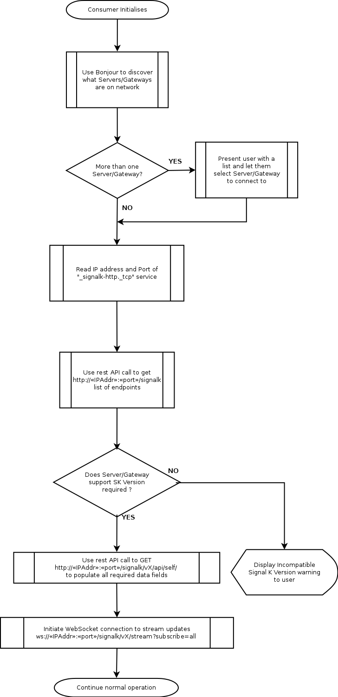

# Discovery and Connection Establishment

## Service Discovery

A Signal K server SHOULD advertise its services using [DNS Service Discovery
(DNS-SD)](https://tools.ietf.org/html/rfc6763) via Multicast DNS (mDNS); also known as Bonjour. The server MUST provide
DNS [Service (SRV) Records](https://en.wikipedia.org/wiki/SRV_record) and [Text (TXT)
Records](https://en.wikipedia.org/wiki/TXT_record) describing the Signal K interfaces it provides. These service
identifiers are:

* `_http._tcp` for the server's web interface
* `_signalk-http._tcp` for the Signal K REST API
* `_signalk-ws._tcp` for the WebSocket data stream
* `_signalk-tcp._tcp` for the TCP data stream

If a server is providing Signal K via secure versions of HTTP or WebSockets then they MUST be able to provide a
redirection to the secure versions of these protocols.

If a Signal K server is using DNS-SD, it MUST provide the following parameters (key/value pairs) in the TXT record
portion of the DNS-SD advertisement:

* `txtvers` is a US-ASCII decimal number identifying the version of the DNS-SD record. Currently, this MUST have a value
  of 1
* `roles` specifies which roles the server is capable of providing. See [Roles](#roles) below for details

The server MAY provide the following values:

* `self` is the unique identifier of the vessel using the URN format specified for the `uuid` field in the Signal K
  schema. It may also use the URN format specified for the `mmsi` field in the Signal K schema if it exists.
* `swname` is the name of the Signal K server software, e.g. signalk-server-node
* `swvers` is the version of the Signal K server software

`swname`, `self` amd `roles` MUST be the same values as provided by the `name`, `self` and `roles` properties within the [Websocket hello message](streaming_api.md) (if implemented).

An example DNS-SD record set is shown below.

```
Service data for service 'signalk-http' of type '_signalk-http._tcp' in domain 'local' on 4.0:
    Host 10-1-1-40.local (10.1.1.40),
    port 80,
    TXT data: [
        'txtvers=1',
        'roles=master,main',
        'self=vessels.urn:mrn:signalk:uuid:c0d79334-4e25-4245-8892-54e8ccc8021d',
        'swname=signalk-server',
        'swvers=0.1.23'
        ]

Service data for service 'signalk-ws' of type '_signalk-ws._tcp' in domain 'local' on 4.0:
    Host 10-1-1-40.local (10.1.1.40),
    port 3000,
    TXT data: [
        'txtvers=1',
        'roles=master,main',
        'self=urn:mrn:signalk:uuid:c0d79334-4e25-4245-8892-54e8ccc8021d',
        'swname=signalk-server',
        'swvers=0.1.23'
        ]
```

These records are advertising a Signal K server with the HTTP REST API on port 80 and the WebSocket data stream on port
3000. The server identifies as having the `master` and `main` roles and provides a `self` identifier as a UUID.

### Roles

The four possible values for `roles` are `master`, `slave`, `main`, and `aux`. These are defined below.

#### Master

`master` is the canonical source for identity and configuration information for the entire vessel.

If there is only one master on the vessel, then it should also provide the main role. The combination of master and main
informs a client that this server is actively providing identifying information.

##### Main and Aux

If there are more than one masters on the vessel, EXACTLY ONE server should advertise both master and main. All other
masters should advertise master and aux. Clients should only use the master aux servers for identifying information if
the master main is not available.

Any server identifying as master MUST be able to provide at a minimum the unique identifier (self) for the vessel.

#### Slave

Any server providing the `slave` role should retrieve identity and configuration information from the master server.
Slave servers MAY provide configuration and identity information for themselves, but this identity MUST NOT be
considered valid for the entire vesssel.

##### Main and Aux

The use of main and aux have not been defined for the slave role at this time.

## Connection Establishment

Using the information above a web client or HTTP capable device can discover and connect to a Signal K server using the
following process:

* Query for Signal K services using mDNS
* Connect to the host and port advertised as 'signalk-http' via HTTP (e.g. `http://10.1.1.40:80`)
* Per the [Urls and Ports](urls_ports.md) section, make a GET request for `/signalk` to retrieve a JSON
  object containing an `endpoints` JSON object
* Make further [REST calls](rest_api.md) for more specific data, or open a websocket connection to [start
  streaming](streaming_api.md) updates.

  
